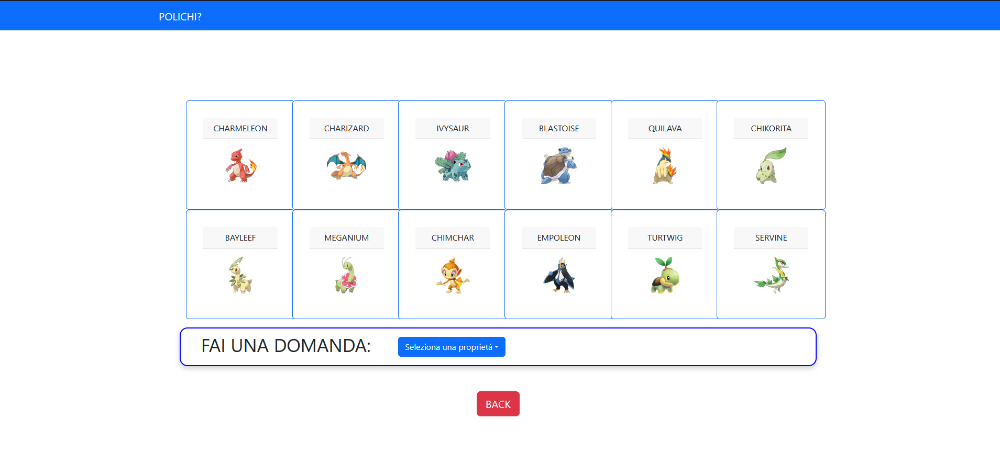

# Exam #3: "INDOVINA CHI"
## Student: s317821 MORLEO ETHAN

## React Client Application Routes

- Route `/`: home page
- Route `/game/:difficulty`: game page of selected difficulty 
- Route `/login`: login form 
- Route `/:username/games`: list of games made by auth user
- Route `/final`: final result page 
- Route `/error`: server error page 

## API Server

- POST `/api/login` AUTH
  - request body:{
    "username": "u1@polito.it",
    "password":"ciao"
  }
  - response body:{
    "id": 1,
    "username": "u1@polito.it",
    "name": "virginia"
}
- DELETE `/api/logout` AUTH
  - response body:{1}

- GET `/api/sessions/current` AUTH
  - response body:{
    "id": 1,
    "username": "u1@polito.it",
    "name": "virginia"
}

- post `/api/newGame`
  - request body:{
    "difficulty": "DIFFICILE"
  }
  - response body:{
    "id": 25,
    "listOfElements": [
        {
            "id": 1,
            "name": "CHARMANDER",
            "type": "FUOCO",
            "evolution": 1,
            "region": "KANTO",
            "enable": "true",
            "img": "/charmander.png",
            "four_legged": "false"
        },
        {
            "id": 2,
            "name": "CHARMELEON",
            "type": "FUOCO",
            "evolution": 2,
            "region": "KANTO",
            "enable": "true",
            "img": "/charmeleon.png",
            "four_legged": "false"
        },
        {
            "id": 3,
            "name": "CHARIZARD",
            "type": "FUOCO",
            "evolution": 3,
            "region": "KANTO",
            "enable": "true",
            "img": "/charizard.png",
            "four_legged": "false"
        },
        {
            "id": 4,
            "name": "BULBASAUR",
            "type": "ERBA",
            "evolution": 1,
            "region": "KANTO",
            "enable": "true",
            "img": "/bulbasaur.png",
            "four_legged": "true"
        },....
    ]
  }
- POST `/api/getAnswer`
  - request body:{
    "answerRequest": {
        "gameId": 29,
	      "tryKey": "isFourLegged",
	      "tryValue": "true"
    }
  }
  - response body: {true/false}

- POST `/api/finalTry`
  - request body:{
    "finalTryRequest": {
        "gameId": 33,
	      "name": "SERVINE"
    }
  }
  - response body: {true/false}

- PUT `/api/updateGame`
  - request body:{
    "updateGameRequest": {
        "gameId": 33,
	      "points": 30,
    }
  }
  - response body: {1}

- GET `/api/games` AUTH
  - response body:{
    "gamesResponse": {
        "total": 55,
        "list": [
            {
                "id": 1,
                "difficulty": "MEDIA",
                "secret": "TOTODILE",
                "points": 20,
                "date": "06/09/2023"
            }...
        ]
    }
}

## Database Tables

- Table `users`   - |id|email|name|salt|password| (PK id) 
- Table `games`   - |id|username|selected_difficulty|secret_element|finish|points|date (PK id)
- Table `pokemon` - |id|name|type|evolution|region|enable|four_legged|img| (PK id) (Unique(id,type,region,evolution,four_legged))

## Main React Components

- `Home` (in `Home.jsx`): home contents, setup difficulty for new game or nav to login 
- `MyLogin` (in `MyLogin.jsx`): login form to auth users
- `MyNavBar` (in `MyNavBar.jsx`): custom navbar
- `Game` (in `Game.jsx`): main game page with objects list
- `PersonalPage` (in `PersonalPage.jsx`): user games list 
- `Final` (in `Final.jsx`): game final result page

(only _main_ components, minor ones may be skipped)

## Screenshot

## Users Credentials

- u1@polito.it, ciao (user with games)
- u2@polito.it, qwerty (user with games)
- u3@polito.it, password (user with no game)

